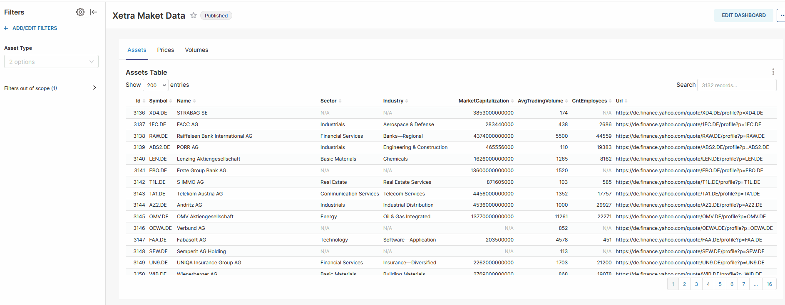
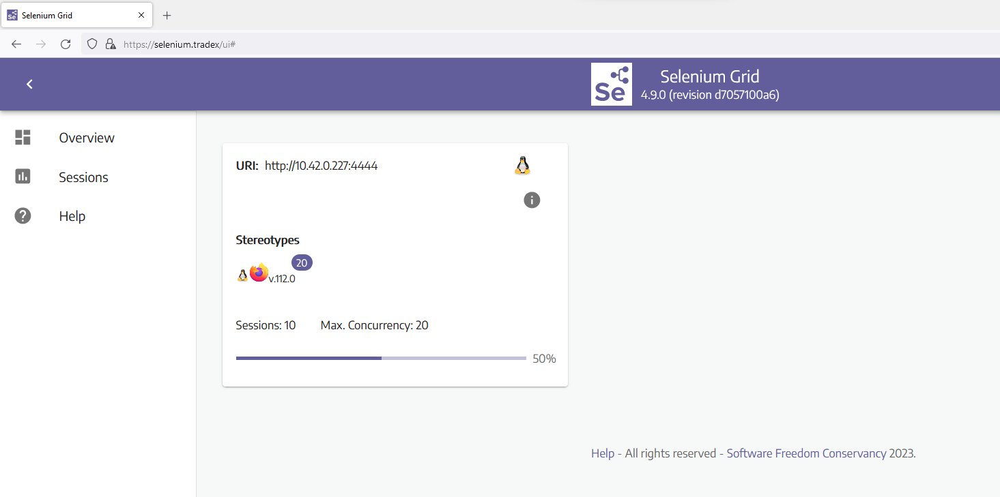
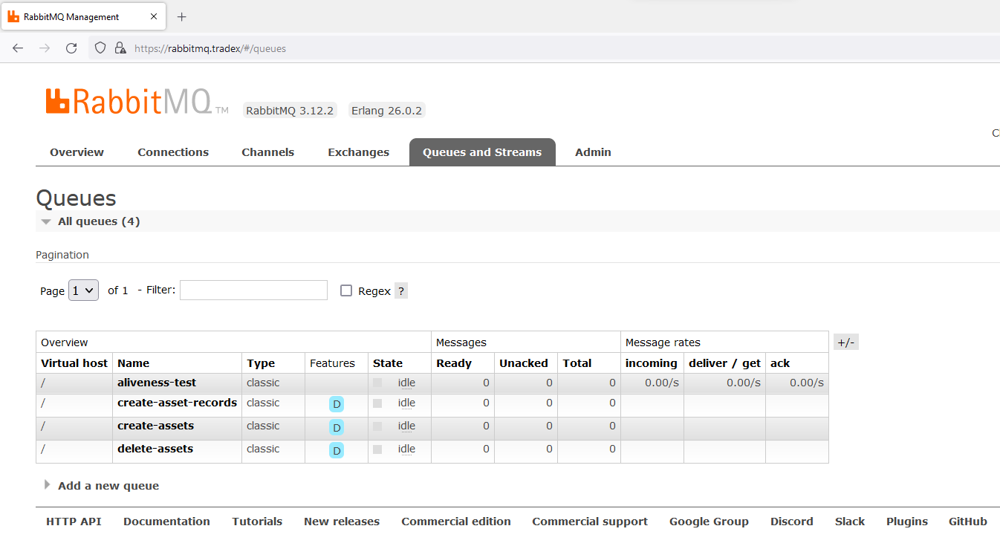
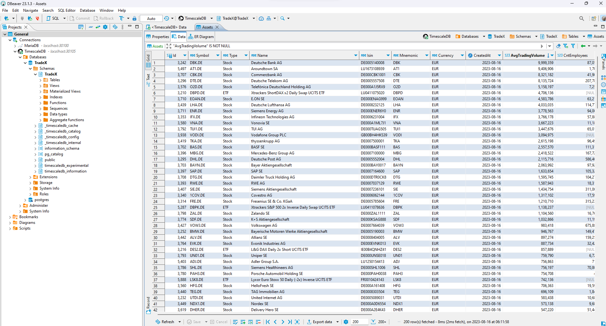
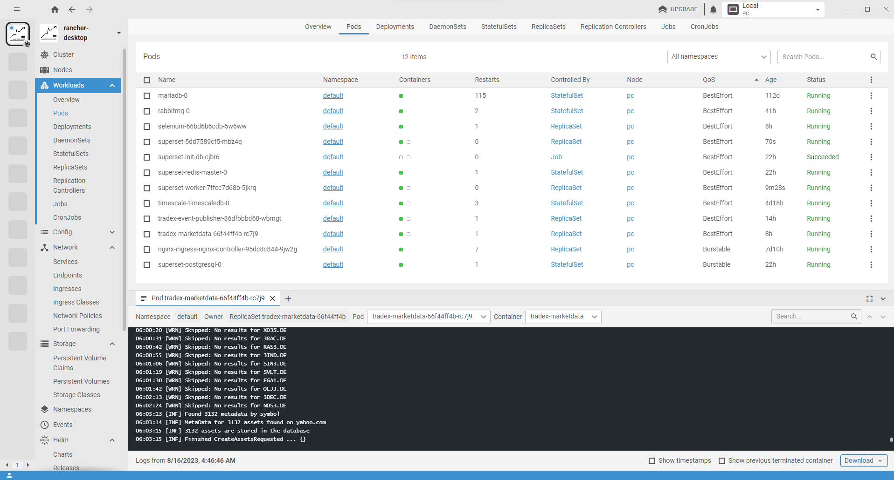

# Xetra Market Data Collector

A microservice that downloads tradable stock market instruments from Xetra.com and then enriches them with metadata at Yahoo.com.  
Finally, the historical courses are downloaded from Yahoo.com via Selenium Firefox WebDriver and stored in a TimescaleDB database.
The graphical user interface to view the data is Apache Superset. 

## Requirements
* Docker and Kubernetes
  * [RancherDesktop](https://docs.rancherdesktop.io/getting-started/installation/) or 
  * [DockerDesktop](https://www.docker.com/products/docker-desktop)
* Package Manager for Kubernetes
  * [Helm](https://helm.sh/docs/intro/install/)

### Optional

* [Lens IDE](https://k8slens.dev/desktop.html) - Control and view the kubernets cluster including resources and logs of the pods
* [DBeaver](https://dbeaver.io/download/) - Database client software application
1
## Installation

1. Run ".\scripts\deploy-infrastructure.cmd", all dependent infrastructure components will be deployt 
1. Run ".\scripts\deploy-service-event-publisher.cmd", builds and deploys the event publisher, used to publish events to RabbitMQ
1. Run ".\scripts\deploy-service-marketdata.cmd", that will build and deploy the main microservice which collects all the data
1. Run ".\scripts\install-nginx-with-ssl-cert\create-and-deploy-ssl-certificate.cmd", it will create an SSL certificate and deploy it to nginx in kubernetes
1. Modify "C:\Windows\System32\drivers\etc\hosts" and add following entries, with that you will can use URL domain names instead of IP adresses to access the local kubernetes cluster
```
127.0.0.1  superset.tradex selenium.tradex rabbitmq.tradex event-publisher.tradex
```

1. Open https://event-publisher.tradex/swagger/index.html
1. Click Post /Asset wo initially create financial assets - this will take about 1-2 hours
1. Click Post /Asset/RecordsByAssetIds, it will download historical couses from yahoo.com and stores them in the database - this will take about 0.5 - 1 hours
1. Click Delete /Asset, which deletes assets which are outdated e.g. Wirecard or where no courses were found on yahoo.com

## Usage


### Apache Superset

* Url: https://superset.tradex/dashboard/list
Username: admin
Password: admin

1. Click import dashboard (icon in the upper right corner) and choose file ".\dashboard_export_20230816T073431.zip"
2. Password for the database is "admin", which can also be found in ".\src\MarketData\MarketData.API\appsettings.json"


### Event Publisher (SwaggerUI) - to trigger events to RabbitMQ which will download and store financial assest or updates historical courses

* Url: https://event-publisher.tradex/swagger/index.html
Username: admin
Password: admin


### Selenium

* Url: https://selenium.tradex/ui#
Password: secret



### RabbitMQ

* Url: https://selenium.tradex/ui#
Username: admin
Password: password



### DBeaver

DBeaver is a very good database client




### Lens

With Lens, you can view all Kubernetes resources, as well as the logs of application actions.



